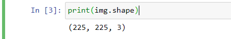
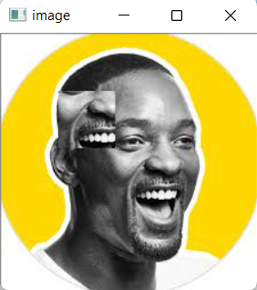

# READ AND WRITE AN IMAGE
## AIM
To write a python program using OpenCV to do the following image manipulations.
i) Read, display, and write an image.
ii) Access the rows and columns in an image.
iii) Cut and paste a small portion of the image.

## Software Required:
Anaconda - Python 3.7
## Algorithm:
### Step1:
Choose an image and save it as a filename.jpg
### Step2:
Use imread(filename, flags) to read the file.
### Step3:
Use imshow(window_name, image) to display the image.
### Step4:
Use imwrite(filename, image) to write the image.
### Step5:
End the program and close the output image windows.
## Program:
### Developed By:Kirupanandhan.T
### Register Number: 21001418
 # To Read,display the image
```
  import cv2
img=cv2.imread('WillSmith.jpg',1)
cv2.imshow('colorimage',img)
cv2.waitKey(0)

cv2.destroyAllWindows()

```
 # To write the image
```
cv2.imwrite('will.jpg',img)


```
 # Find the shape of the Image
```

print(img.shape)

```
# To access rows and columns
```
import random
for i in range(100):
    for j in range(img.shape[1]):
        img[i][j]=[random.randint(0,255),random.randint(0,255),random.randint(0,255)]

cv2.imshow("image",img)
cv2.waitKey(0)
cv2.destroyAllWindows()


```
# To cut and paste portion of image
```

import cv2
img=cv2.imread('WillSmith.jpg',-1)
tag=img[100:150,100:150]
img[50:100,50:100]=tag
cv2.imshow('image',img)
cv2.waitKey(0)
cv2.destroyAllWindows()

```

## Output:

### i) Read and display the image


<br>

### ii)Write the image


<br>

### iii)Shape of the Image


<br>

### iv)Access rows and columns

<br>

### v)Cut and paste portion of image

<br>

## Result:
Thus the images are read, displayed, and written successfully using the python program.


